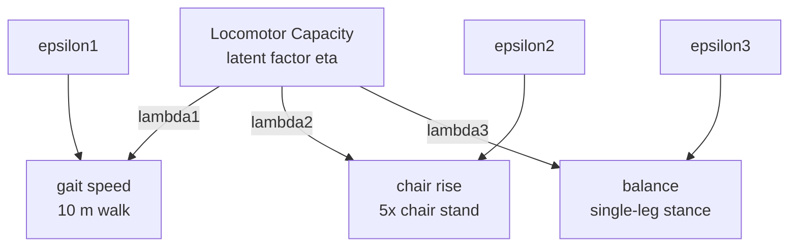

# 32 CFA 3-item Measurement Model

## Manuscript-ready model description

The core locomotor capacity model is a one-factor confirmatory factor analysis
with three reflective indicators:

`Capacity =~ gait + chair + balance`

Interpretation of indicators:

- `gait`: gait speed from the timed 10-meter walk test
- `chair`: chair rise performance from the five-times chair stand test
- `balance`: standing balance from single-leg stance performance

## Simple figure version

Locomotor Capacity -> gait speed  
Locomotor Capacity -> chair rise  
Locomotor Capacity -> balance

## Mermaid diagram

## Suggested figure caption

Measurement model for the latent locomotor capacity construct. The latent factor
was specified using three reflective indicators: gait speed, chair rise
performance, and standing balance. Estimated factor loadings quantify the
strength of association between each observed indicator and the underlying
locomotor capacity construct.

## Suggested Results sentence

The latent locomotor capacity construct was modeled as a one-factor CFA with
three reflective indicators: gait speed, chair rise performance, and standing
balance.
