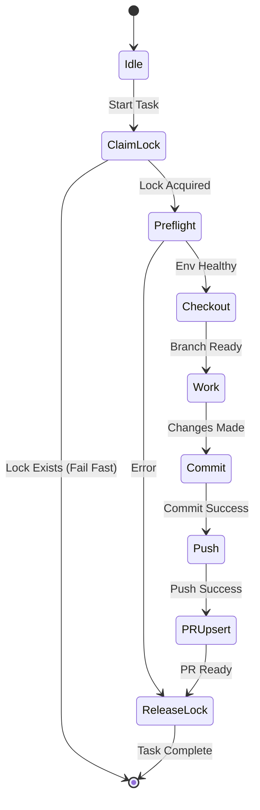

# Git Workflow State Machine

This document defines the deterministic state machine for agent-driven git operations in `Quantify-FOF-Utilization-Costs`.

## State Diagram

## State Definitions

### 1. Idle

- **Description**: Agent is waiting for a task.
- **Rule**: No active `.agent.lock` file should exist for this agent (or generally).

### 2. Claim Lock

- **Description**: Attempt to acquire exclusive rights to operate on the repo.
- **Action**: Check for `.agent.lock`. If exists -> Fail (Exit 1). If not -> Create file.
- **Stop Condition**: Lock already exists.

### 3. Preflight

- **Description**: Verify environment health.
- **Action**: Check network, auth status, working directory.

### 4. Checkout (Idempotent)

- **Description**: Switch to the target branch.
- **Action**: Handle local vs remote vs new branch creation logic.
- **Rule**: Must be idempotent (running twice changes nothing the second time).

### 5. Work

- **Description**: The actual task execution (code changes).

### 6. Commit

- **Description**: Persist changes.
- **Action**: `git add`, `git commit`.

### 7. Push

- **Description**: Sync to remote.
- **Action**: `git push`.

### 8. PR Upsert

- **Description**: Ensure a Pull Request exists.
- **Action**: Check existing PRs. Create if missing. Update if needed.

### 9. Release Lock

- **Description**: Clean up.
- **Action**: Remove `.agent.lock`.
